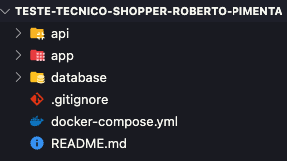
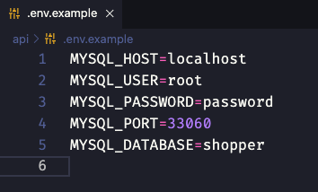
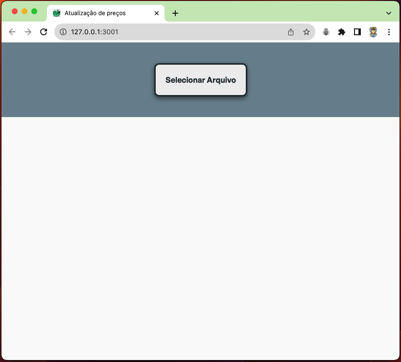
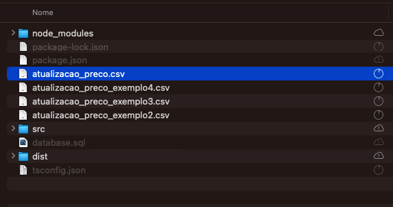
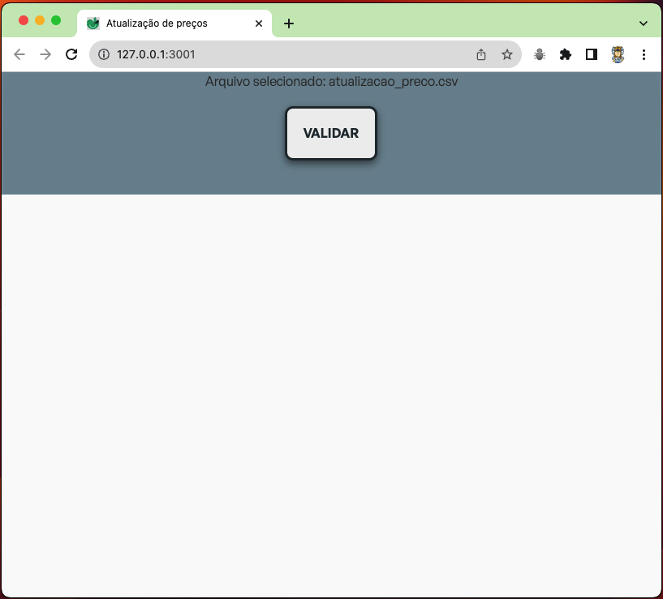
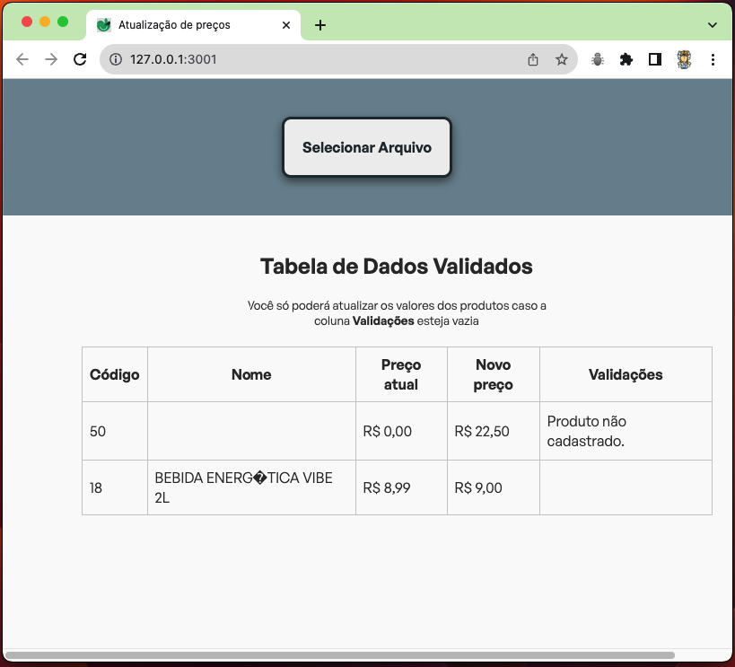
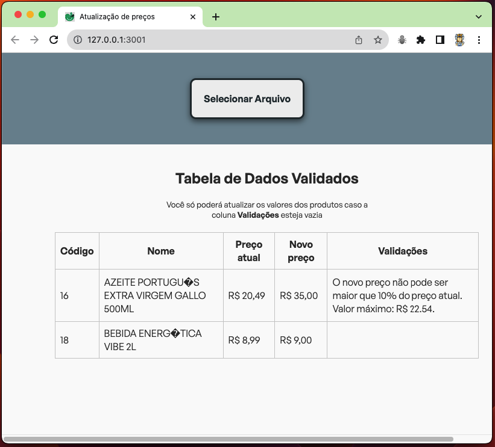
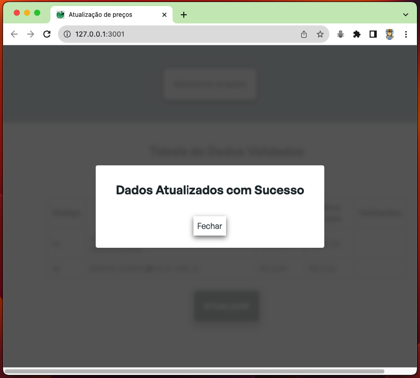

# Candidato: Roberto Ayres Pimenta

Teste técnico - Desenvolvedor Full Stack Junior (Shopper)

---

Para rodar o projeto, atente-se a cada passo descrito a seguir, e se tiver qualquer dúvida, envie um email para roberto.uft@gmail.com 🚀

---

Clone o projeto no seu computador, ele terá a seguinte estrutura:

# Dependências

- Node
- Docker

## Buildando e rodando no Docker

Em um terminal:

1. docker compose up -d --build

   Irá subir os serviços de back-end na porta 3000 e banco de dados MySQL na porta 3306.

Agora execute:

1. docker build -t vite-app .
2. docker run -p 80:80 vite-app

Subirá o front-end em localhost:80

OBS: O MySQL vai subir na porta 3306 do seu computador, certifique-se de que ela não está em uso.

A aplicação já está configurada para se conectar com o banco de dados que subir com o Docker.

---

## Instalação e execução localmente

## Subindo o back-end:

Abra um terminal e acesse o diretório api, dentro dele instale as dependências `npm install`, após a conclusão rode o comando para executar o servidor back-end `npm start`. Ele deve responder com um console.log confirmando a execução do servidor na porta 3000.

---

## Subindo o front-end:

Abra um segundo terminal e acesse o diretório app, dentro dele instale as dependências `npm install`, após a conclusão rode o comando para executar o servidor front-end `npm start`. Uma aba do seu navegador deve abrir com o servidor executando na porta 3001.

---

Caso não utilize o docker para subir o banco de dados e deseja utilizar o mysql que está instalado no seu computador ou outro container que esteja rodando basta alterar as informações no arquivo .envexample, que está na raiz de api e colocar suas credenciais:

Nesse caso você precisará executar o _script_ para criação do banco de dados que a aplicação utiliza, basta abrir o _scrip_ 'database.sql' que está na raiz do diretório api e executar no seu SGBD favorito.

---

Tela inicial

Ao clicar em 'Selecionar Arquivo' só permitido selecionar arquivos com a extensão .csv:

Agora podemos validar o arquivo:

Como não há pendências nos produtos a alterar o preço é possível realizar a atualização dos mesmos, mas caso seja passado algum parâmetro incorreto:

A opção de atualização não é carregada e o motivo é indicado na coluna 'Validações'.

Abaixo uma tentativa de novo preço acima dos 10% permitidos:

Com os valores validados e a coluna 'Validações' vazia é possível realizar a alteração:

